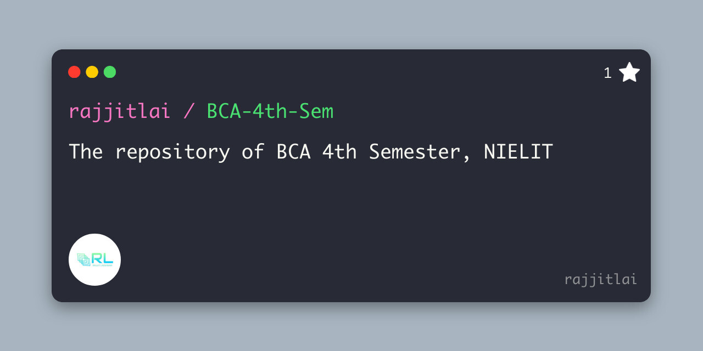

# Welcome to NIELIT, BCA 4th Sem Repository

<hr>
<div align="center">
  
</div>
<hr>

## Contributing

Welcome Contributors!
Thank you for your interest in contributing to our college project! We value your time and expertise, and we're excited to collaborate with you. Whether you're a seasoned developer or just starting out, there are plenty of opportunities to get involved and make a meaningful impact.

### How to Contribute

1. **Fork the Repository:** Start by forking our repository to your own GitHub account.

2. **Clone the Repository:** Clone the forked repository to your local machine using Git.

   ```bash
   git clone https://github.com/rajjitlai/BCA-4th-Sem.git

3. **Create a Branch:** Create a new branch for your contributions.

    ```bash
    git checkout -b feature/new-contribution

4. **Make Changes:** Work on your contribution, whether it's adding new class notes, lecture slides, assignments, or other study materials relevant to the NIELIT BCA 4th semester curriculum.

5. **Commit Changes:** Once you're satisfied with your changes, commit them to your branch.

    ```bash
    git add .
    git commit -m "Add new class notes: [Your unique message here]" 

6. **Push Changes:** Push your changes to your forked repository.

    ```bash
    git push origin feature/new-contribution

7. **Submit a Pull Request:** Finally, submit a pull request from your branch to our main repository. Be sure to provide a clear description of your contribution and any relevant information.
### Guidelines
- Please follow the [code of conduct](./Shared/code_of_conduct.md) and adhere to our project's guidelines.
- If you're working on a new feature, consider opening an issue first to discuss it with the team.
- Write clear, concise commit messages and code comments to ensure readability.
- Test your changes thoroughly before submitting a pull request.
- Be open to feedback and willing to collaborate with others.

## Questions

If you have any questions about this project, please feel free to create a new issue

### Get in Touch
If you have any questions or need assistance, don't hesitate to reach out. You can [contact us](mailto:rajjitlai@mail.com) via email or [open an issue](https://github.com/rajjitlai/BCA-4th-Sem-Web/issues/new) in our repository. We're here to help and support you throughout your contribution journey.

Thank you for being a part of our community and for helping us make this project a success!

Happy coding! <br><br>
<i>Commander</i>

## Contributors
<table>
<td><p align="center">Rajjit Laishram  <br><br></p><p align="center"><a href = "https://github.com/rajjitlai"></a></p></td>
  
<td><p align="center"> Shadow Leaked <br><br></p><p align="center"><a href = "https://github.com/shadow-leaked"></a></p></td>

</table>
